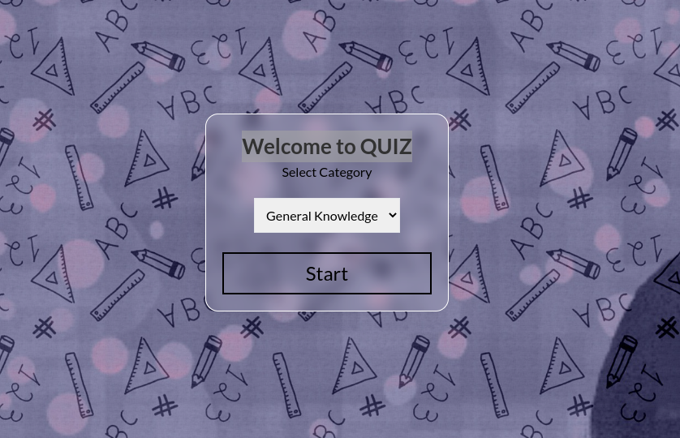

<h1>Quiz Challenge</h1>

 

LIVE DEMO: <a href="https://quiz-app-challenge.netlify.app/" target="_blank">Quiz Challenge</a> 

<h2>API</h2>
<a href="https://the-trivia-api.com/">THE TRIVIA API</a>  

<h2>Used tools</h2>
<a href="https://reactjs.org/">React</a>  
<a href="https://tailwindcss.com/">Tailwind CSS</a>  
<a href="https://react-icons.github.io/react-icons/">React Icons</a>  
<a href="https://redux.js.org/">Redux</a>  
<a href="https://react-redux.js.org/">React Redux</a>  
<a href="https://reactrouter.com/docs/en/v6">React Router</a>  
<a href="https://www.framer.com/motion/">Framer Motion</a>  
<a href="https://www.npmjs.com/package/react-loader-spinner">React Loader Spinner</a>  
<a href="https://axios-http.com/docs/intro">Axios</a>  

<h2>Project IDEA</h2>
<a href="https://devchallenges.io/">DevChallenges.io</a>
